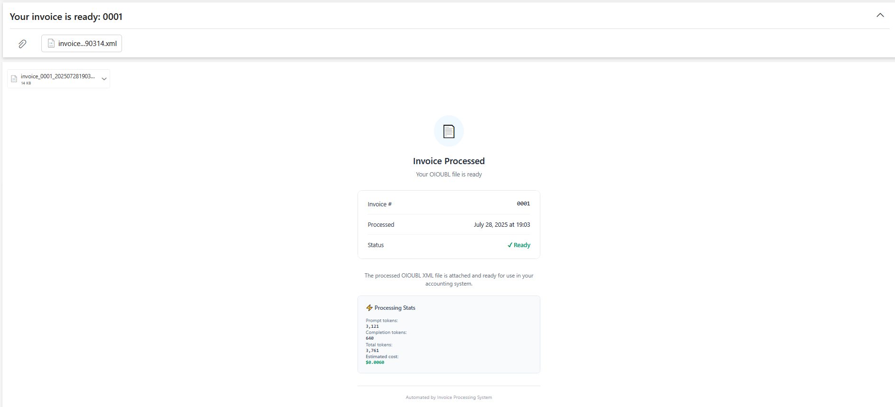

# Danish Invoice Processing System

A Python application that automates the conversion of Danish invoices from PDF format to standardized OIOUBL XML format. The system can process invoices from Outlook emails or directly from local PDF files, using AI-powered data extraction to create compliant electronic invoices for Danish accounting systems.

## Features

- **📧 Email Processing**: Automatically processes PDF invoices from Outlook emails
- **📁 Local Processing**: Process PDF files directly from a local folder
- **🤖 AI-Powered Extraction**: Uses OpenAI GPT models to extract invoice data from PDFs
- **📋 OIOUBL XML Generation**: Creates standardized Danish OIOUBL 2.02 compliant XML invoices
- **✅ Data Validation**: Validates extracted data and applies business rules
- **💰 Token Tracking**: Monitors OpenAI API usage and costs
- **📧 Automated Delivery**: Sends processed invoices via email
- **🔄 Flexible Processing**: Handles both email and local file workflows

## What is OIOUBL?

OIOUBL (Offentlig Information Online UBL) is the Danish standard for electronic invoicing based on the international UBL (Universal Business Language) format. This system converts traditional PDF invoices into structured XML format that can be:

- Automatically processed by Danish accounting systems
- Imported into ERP systems without manual data entry
- Validated against Danish business rules and tax requirements
- Used for efficient invoice workflows in Danish businesses

## Quick Start

### Email Processing (Default)
```bash
python main.py
```
Processes invoices from Outlook emails automatically.

### Local PDF Processing
```bash
python main.py --local
```
Processes PDF files from the `local/` directory.

## Setup

### 1. Clone and Install
```bash
git clone https://github.com/shovonjamali/danish-invoice-processor
cd danish-invoice-processor
python -m venv venv

# Activate virtual environment
# Windows:
venv\Scripts\activate
# Unix/MacOS:
source venv/bin/activate

pip install -r requirements.txt
```

### 2. Environment Configuration
Copy `.env.example` to `.env` and configure:

```bash
# Microsoft Graph API Credentials
MS_CLIENT_ID=your_client_id
MS_CLIENT_SECRET=your_client_secret
MS_TENANT_ID=your_tenant_id

# Source inbox for invoice processing
TARGET_EMAIL=user@example.com

# Invoice recipient email
INVOICE_RECIPIENT=recipient@example.com

# OpenAI API Key
OPENAI_API_KEY=your_openai_api_key

# App Configuration
LOG_LEVEL=INFO
DOWNLOAD_PATH=./downloads

# Number of days to keep generated files in the output directory
OUTPUT_FILES_MAX_AGE_DAYS=3

# Customer data handling: 
# true = Always use default customer (Nordsjælland Teknik ApS)
# false = Extract customer from PDF, use default as fallback
USE_DEFAULT_CUSTOMER_ONLY=true
```

### 3. Create Required Directories
```bash
mkdir local processed
```

## Usage

### Email Processing Workflow
1. **Setup**: Configure Azure AD app and email credentials
2. **Send Invoices**: Email PDF invoices to the configured `TARGET_EMAIL`
3. **Process**: Run `python main.py` to process unread emails
4. **Receive**: Processed OIOUBL XML files are emailed to `INVOICE_RECIPIENT`

#### Email Output Example

The system sends formatted HTML emails with processing results:



<!-- **Email Features:**
- 📊 **Professional Design**: Clean, modern HTML layout
- 📄 **Invoice Details**: Invoice number, processing date, and status
- 📈 **Processing Stats**: Token usage and estimated API costs
- 📎 **XML Attachment**: Ready-to-use OIOUBL file attached
- ✅ **Clear Status**: Visual indicators for successful processing
- 💰 **Cost Tracking**: Transparent API usage information

**Sample Email Content:**
```
Subject: Your invoice is ready: 112262

✓ Invoice #112262 processed successfully
📅 Processed: December 1, 2024 at 14:23
📎 OIOUBL XML file attached and ready for your accounting system

Processing Stats:
• Prompt tokens: 1,234
• Completion tokens: 567  
• Total tokens: 1,801
• Estimated cost: $0.0032

The processed OIOUBL XML file is attached and ready for use.
``` -->

### Local Processing Workflow
1. **Add PDFs**: Drop PDF invoice files into the `local/` directory
2. **Process**: Run `python main.py --local`
3. **Results**: 
   - Generated XML files appear in `output/` directory
   - Processed PDFs move to `processed/` directory
   - Console shows processing status and token usage

### Testing with Sample Invoice

Want to test the system quickly? We've included a sample fictional invoice:

📄 **Sample Invoice**: [`docs/samples/Sample_Fictional_Invoice.pdf`](docs/samples/Sample_Fictional_Invoice.pdf)

**Quick Test Steps:**
1. Copy the sample invoice to your `local/` directory:
   ```bash
   cp docs/samples/Sample_Fictional_Invoice.pdf local/
   ```
2. Run local processing:
   ```bash
   python main.py --local
   ```
3. Check the results in `output/` directory
4. Validate the generated XML at [OIOUBL Validator](http://www.oioubl2.info/validator2016/)

This sample invoice contains typical Danish invoice elements and demonstrates the full processing pipeline.

### Example Output
```
✓ Successfully processed invoice_123.pdf -> invoice_123_20241201123045.xml
✗ Failed to extract content from PDF: corrupted_file.pdf
✓ Successfully processed invoice_456.pdf -> invoice_456_20241201123046.xml

============================================================
LOCAL PDF PROCESSING SUMMARY
============================================================
Total files processed: 3
Successful: 2
Failed: 1

Token Usage:
  Prompt tokens: 1,234
  Completion tokens: 567
  Total tokens: 1,801
  Estimated cost: $0.0032
============================================================
```

## Azure AD Setup for Email Processing

### 1. Create an Azure AD Application
1. Sign in to the [Azure Portal](https://portal.azure.com)
2. Navigate to **Microsoft Entra ID** > **App registrations** > **New registration**
3. Enter a name for your application (e.g., "danish-invoice-processor")
4. Select **Accounts in this organizational directory only**
5. Leave Redirect URI blank
6. Click **Register**

### 2. Configure API Permissions
1. In your newly created app, go to **API permissions**
2. Click **Add a permission**
3. Select **Microsoft Graph**
4. Choose **Application permissions**
5. Add these permissions:
   - `Mail.Read`
   - `Mail.ReadWrite`
   - `Mail.Send`
6. Click **Add permissions**

### 3. Create a Client Secret
1. Go to **Certificates & secrets**
2. Under **Client secrets**, click **New client secret**
3. Add a description and select an expiration period
4. Click **Add**
5. **IMPORTANT**: Copy the secret value immediately - you won't be able to see it again

### 4. Grant Admin Consent
1. Return to **API permissions**
2. Click **Grant admin consent for [your organization]**
3. Confirm when prompted

### 5. Note Required Information
You'll need these values for your `.env` file:
- **Application (client) ID**: Found in app overview
- **Directory (tenant) ID**: Found in app overview  
- **Client Secret**: The value you copied in step 3

## Project Structure

```
project-root/
│
├── main.py                          # Main application entry point
│
├── config/                          # Configuration files
│   ├── credentials.py               # Environment variables and validation
│   ├── settings.py                  # Application settings and paths
│   ├── company_cvr_map.json         # Company CVR/GLN mappings
│   └── default_customer.json        # Default customer configuration
│
├── services/                        # Core business logic services
│   ├── email_service.py             # Microsoft Graph email operations
│   ├── pdf_service.py               # PDF to markdown conversion
│   ├── invoice_service.py           # Invoice data extraction and XML generation
│   ├── local_pdf_service.py         # Local PDF processing
│   └── graph_client.py              # Microsoft Graph API client
│
├── utils/                           # Utility functions
│   ├── file_utils.py                # File handling utilities
│   ├── token_tracker.py             # OpenAI token usage tracking
│   └── auth.py                      # Microsoft authentication
│
├── local/                           # PDFs to process (user input)
├── processed/                       # Successfully processed PDFs
├── output/                          # Generated OIOUBL XML files
└── downloads/                       # Temporary email attachments
```

## Supported Invoice Data

The system extracts and processes:

- **Invoice Details**: Number, date, due date, currency
- **Supplier Information**: Name, address, CVR number, VAT number
- **Customer Information**: Name, address, CVR number (or uses default)
- **Line Items**: Description, quantity, unit price, tax amounts
- **Payment Information**: Payment terms, bank details, FIK payment codes
- **Additional Charges**: Environmental fees, shipping costs
- **Tax Calculations**: Danish VAT (25%) calculations and totals

## Company Mappings & Supplier Configuration

### Automatic Supplier Recognition

The system includes pre-configured mappings for major Danish companies:

- **LEGO System A/S** (CVR: 47458714)
- **Universal Robots A/S** (CVR: 29138060)
- **Danfoss A/S** (CVR: 20165715)
- **Novo Nordisk A/S** (CVR: 24256790)
- **Carlsberg Breweries A/S** (CVR: 25508343)

### Custom Supplier Configuration

**Why Configure Suppliers Manually?**

Sometimes the AI extraction may fail to capture supplier CVR numbers from invoices, especially when:
- 🖼️ **Scanned/Image-based PDFs**: CVR numbers embedded in images (OCR not yet supported)
- 📄 **Poor Quality Scans**: Blurry or low-resolution documents
- 🎨 **Complex Layouts**: Unusual invoice designs or formats
- 📋 **Non-standard Formats**: Custom invoice templates

**Cost-Effective Solution**

Instead of implementing expensive OCR services or external CVR lookup APIs, you can configure your regular suppliers once. Since you typically receive invoices from the same suppliers repeatedly, this one-time setup saves both:
- 💰 **API Costs**: No need for paid CVR lookup services
- ⏱️ **Processing Time**: Instant supplier recognition
- 🎯 **Accuracy**: 100% correct supplier data

### How to Add Custom Suppliers

Edit `config/company_cvr_map.json` to include your suppliers:

```json
{
  "company_cvr_map": {
    "your supplier name": "12345678",
    "another supplier": "87654321",
    "local contractor": "11223344"
  },
  "company_gln_map": {
    "your supplier name": "5790000111111",
    "another supplier": "5790000222222", 
    "local contractor": "5790000333333"
  }
}
```

**Configuration Tips:**
- Use **lowercase company names** for matching
- Include **common variations** (e.g., "company a/s", "company aps")
- Add **8-digit CVR numbers** (Danish format)
- Generate **realistic GLN numbers** starting with "5790000"

**Example Configuration:**
```json
{
  "company_cvr_map": {
    "mikkelsen elektrik": "12345678",
    "mikkelsen elektrik a/s": "12345678",
    "copenhagen consulting": "87654321",
    "kbh consulting": "87654321",
    "nordsjælland service": "11223344"
  }
}
```

This approach ensures reliable invoice processing even when supplier information isn't perfectly extractable from PDF text.

## Validation

Generated XML files should be validated using the official OIOUBL validator:

**🔗 [OIOUBL Validator](http://www.oioubl2.info/validator2016/)**

After processing, it's recommended to validate the XML to ensure:
- ✅ OIOUBL 2.02 compliance
- ✅ Correct data population (amounts, dates, references)
- ✅ Valid Danish business rules
- ✅ Proper tax calculations

## Documentation

- **📖 [OIOUBL Official Documentation](https://oioubl21.oioubl.dk/Classes/da/FinancialInstitution.html)**
- **🔍 [OIOUBL Validator](http://www.oioubl2.info/validator2016/)**
- **⚡ [OpenAI API Documentation](https://platform.openai.com/docs)**
- **📧 [Microsoft Graph API](https://docs.microsoft.com/en-us/graph/)**

## Testing

The project includes comprehensive test coverage for all major components using pytest.

### Install Test Dependencies

Test dependencies are included in `requirements.txt`:
```bash
pip install -r requirements.txt
```

Or install testing packages separately:
```bash
pip install pytest pytest-mock pytest-cov
```

### Test Structure

```
tests/
├── __init__.py                    # Makes tests a Python package
├── conftest.py                    # Shared fixtures and configuration
├── test_email_service.py          # Email processing tests (11 tests)
├── test_pdf_service.py            # PDF conversion tests (5 tests)  
└── test_local_pdf_service.py      # Local file processing tests (10 tests)
```

### Running Tests

#### Basic Test Commands
```bash
# Run all tests
pytest

# Run all tests with verbose output
pytest -v

# Run all tests with extra verbose output
pytest -vv

# Run tests and show print statements
pytest -s
```

#### Running Specific Tests
```bash
# Run tests from a specific file
pytest tests/test_email_service.py

# Run a specific test function
pytest tests/test_email_service.py::test_get_unread_emails

# Run tests matching a pattern
pytest -k "email" tests/

# Run tests matching multiple patterns
pytest -k "email or pdf" tests/
```

#### Coverage Reports
```bash
# Run tests with coverage report
pytest --cov=services tests/

# Generate HTML coverage report
pytest --cov=services --cov-report=html tests/

# Generate coverage report with missing lines
pytest --cov=services --cov-report=term-missing tests/

# Save coverage to file
pytest --cov=services --cov-report=xml tests/
```

#### Test Results and Debugging
```bash
# Run only failed tests from last run
pytest --lf

# Run failed tests first, then remaining tests
pytest --ff

# Stop on first failure
pytest -x

# Stop after N failures
pytest --maxfail=3

# Show detailed traceback on failures
pytest --tb=long

# Show short traceback
pytest --tb=short

# Run tests in parallel (requires pytest-xdist)
pytest -n auto
```

#### Test Discovery and Collection
```bash
# Show which tests would be run (dry run)
pytest --collect-only

# Show test durations
pytest --durations=10

# Show slowest 5 tests
pytest --durations=5 tests/
```

#### Continuous Testing
```bash
# Watch for file changes and re-run tests (requires pytest-watch)
ptw tests/

# Re-run tests when code changes
pytest-watch tests/
```

### Test Coverage

Current test coverage includes:

**Email Service (11 tests):**
- ✅ Retrieve unread emails from Outlook
- ✅ Get email attachments (PDF, XML files)
- ✅ Download attachments with proper error handling
- ✅ Mark emails as read after processing
- ✅ Send processed invoices via email
- ✅ Handle missing recipients and file errors
- ✅ Support direct XML forwarding

**PDF Service (5 tests):**
- ✅ Convert PDF files to markdown text
- ✅ Handle empty or corrupted PDF files
- ✅ Process Danish content with special characters
- ✅ Error handling for file access issues
- ✅ Service initialization with/without plugins

**Local PDF Service (10 tests):**
- ✅ Discover PDF files in local directory
- ✅ Process individual PDF files
- ✅ Move processed files to archive directory
- ✅ Batch process multiple PDF files
- ✅ Generate processing statistics and reports
- ✅ Handle mixed success/failure scenarios
- ✅ Token usage tracking and cost calculation

### Expected Test Output

#### Successful Test Run:
```
================================= test session starts =================================
platform win32 -- Python 3.11.0, pytest-7.4.0, pluggy-1.3.0
rootdir: /path/to/your/project
collected 26 items

tests/test_email_service.py ........... [ 42%]
tests/test_pdf_service.py ..... [ 61%]
tests/test_local_pdf_service.py .......... [100%]

================================= 26 passed in 2.45s =================================
```

#### Coverage Report Example:
```
Name                               Stmts   Miss  Cover   Missing
----------------------------------------------------------------
services/__init__.py                   0      0   100%
services/email_service.py            125     12    90%   45-47, 89-92
services/pdf_service.py               25      2    92%   28-29
services/local_pdf_service.py         89      8    91%   67-70, 95-98
services/graph_client.py              45      5    89%   78-82
services/invoice_service.py          245     35    86%   [various lines]
----------------------------------------------------------------
TOTAL                                529     62    88%
```

### Troubleshooting Tests

#### Common Issues:

**Import Errors:**
```bash
# Make sure you're in the project root directory
cd /path/to/your/project

# Verify Python path
python -c "import sys; print(sys.path)"

# Install in development mode
pip install -e .
```

**Missing Dependencies:**
```bash
# Install missing test packages
pip install pytest pytest-mock pytest-cov

# Verify installation
pytest --version
```

**Mock-Related Errors:**
```bash
# Clear Python cache
find . -name "*.pyc" -delete
find . -name "__pycache__" -delete

# Restart your IDE/terminal
```

**Environment Variable Issues:**
Tests use mocked environment variables, so real credentials aren't needed. If you see environment errors:
```bash
# Check conftest.py is properly configured
cat tests/conftest.py
```

#### Debugging Failed Tests:

```bash
# Run with maximum verbosity
pytest -vvv --tb=long tests/test_email_service.py::test_send_invoice_success

# Add debugging prints to tests (then run with -s)
pytest -s tests/test_email_service.py::test_send_invoice_success

# Use debugger (requires pdb)
pytest --pdb tests/test_email_service.py::test_send_invoice_success
```

### Writing New Tests

When adding new functionality, include tests:

```python
# Example test structure
def test_new_feature():
    # Arrange - Set up test data and mocks
    mock_data = {"key": "value"}
    
    # Act - Call the function being tested
    result = service.new_function(mock_data)
    
    # Assert - Verify the results
    assert result is True
    assert "expected" in result_data
```

### Test Data

Tests use mocked data and don't require:
- ❌ Real PDF files
- ❌ Real email accounts  
- ❌ Real Azure credentials
- ❌ Real OpenAI API keys

All external dependencies are mocked for fast, reliable testing.

## Troubleshooting

### Common Issues

**Email Processing Not Working**
- Verify Azure AD app permissions are granted
- Check that `TARGET_EMAIL` mailbox is accessible
- Ensure client secret hasn't expired

**PDF Extraction Fails**
- Verify PDF is not password-protected or corrupted
- Check OpenAI API key is valid and has sufficient credits
- Review logs for specific extraction errors

**XML Validation Errors**
- Use the OIOUBL validator to identify specific issues
- Check that all required fields are populated
- Verify CVR numbers are in correct format (8 digits)

**Token Usage High**
- Consider processing PDFs in smaller batches
- Review extraction prompts for optimization opportunities
- Monitor costs through OpenAI dashboard

### Logs

The application logs detailed information about:
- PDF processing status
- Data extraction results
- XML generation steps
- Token usage and costs
- Error details for troubleshooting

Check console output and log files for detailed processing information.

<!-- ## Contributing

1. Fork the repository
2. Create a feature branch
3. Make your changes
4. Add tests for new functionality
5. Submit a pull request

## License

[Add your license information here]

--- -->

**Built for Danish businesses to streamline invoice processing and improve accounting workflow efficiency.**